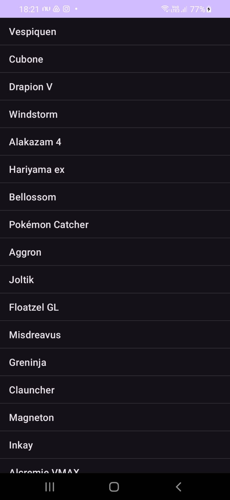
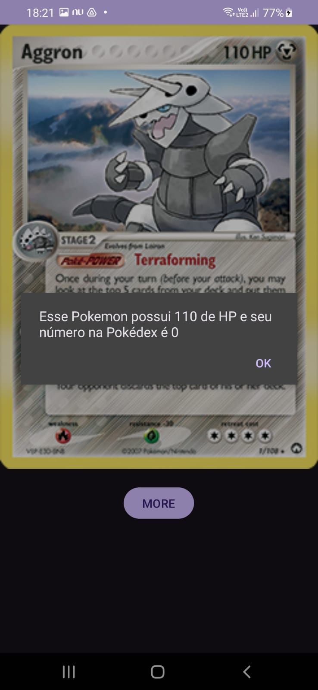

## Pokedex App - README

This is a basic Pokedex app for Android that retrieves Pokemon information and displays it in a user-friendly interface. It uses the https://pokemontcg.io/ to display 20 pokemon names and there attributes

### URL/Endpoint
https://api.pokemontcg.io/* 
*/v1/cards?count=20

### Features

* Fetches data for the first 20 Pokemon from an API.
* Displays a list of Pokemon names.
* Clicking on a Pokemon name opens a detail activity with the following information:
    * Image
    * Name
    * HP
    * National Pokedex Number

### Getting Started

1. **Prerequisites:**
    * Android Studio
    * Basic knowledge of Java and Android development

2. **Import project:**
    * Open Android Studio
    * Go to **File -> Open**
    * Select the project directory you cloned

3. **Dependencies:**
    * The project uses Retrofit2 for making API calls. Ensure you have the necessary dependencies configured in your `app/build.gradle` file.
    * The project uses Picasso to show the images of the pokemon on screen

### Running the App

1. Connect an Android device or start an emulator.
2. Run the app from Android Studio.

### Results

### Code Structure

* `MainActivity`: This is the main activity that displays the list of Pokemon names. It fetches data from the API, populates the list view, and handles clicks on Pokemon names to open the detail activity.
* `ApiCard`: This class interacts with the Pokedex API (implementation not included).
* `ResponseData`: This class represents the response data from the API (implementation not included).
* `Card`: This class represents a Pokemon object with its attributes (name, image URL, HP, national Pokedex number).
* `PokemonDetailActivity`: This activity displays detailed information about a selected Pokemon (implementation not included).
